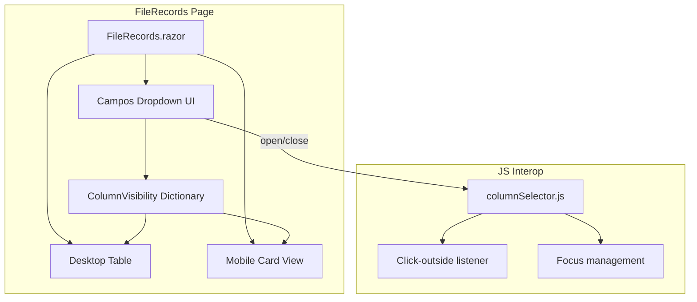

# Design Document: Column Visibility Selector

## Overview

This feature adds a "Campos" dropdown with checkboxes to the file-records page toolbar, allowing users to toggle the visibility of individual table columns. The implementation is entirely client-side within the Blazor component — no API changes are needed since column visibility is a UI concern that filters which data fields are rendered, not which data is fetched.

### Key Design Decisions

1. **Pure client-side state** — Column visibility is managed as component state in `FileRecords.razor.cs`. No persistence to localStorage or server. State resets to defaults on every page navigation, as specified in the requirements.
2. **Dictionary-based visibility model** — A `Dictionary<string, bool>` maps column identifiers to their visibility state. This makes toggling O(1) and iteration straightforward for rendering conditionals.
3. **Click-outside close via JS interop** — Blazor doesn't natively detect clicks outside a component boundary. A small JS module registers a `mousedown` listener on the document when the dropdown opens, closing it when the click target is outside the dropdown element.
4. **No new components** — The dropdown is implemented inline in `FileRecords.razor` with supporting methods in the code-behind. The feature is small enough that extracting a separate component would add indirection without meaningful reuse benefit.
5. **Column order defined once** — A static list defines the canonical column order. Rendering always iterates this list and skips hidden columns, guaranteeing consistent ordering regardless of toggle history.

## Architecture



### Interaction Flow

1. Page loads → `ColumnVisibility` dictionary initialized with defaults (all visible except Nº Disquete)
2. User clicks "Campos" button → dropdown opens, JS click-outside listener registered
3. User toggles a checkbox → `ToggleColumnVisibility(columnId)` called → dictionary updated → `StateHasChanged()` triggers re-render
4. Table/cards re-render, skipping columns where `ColumnVisibility[id] == false`
5. User clicks outside or presses Escape → dropdown closes, JS listener removed

## Components and Interfaces

### Column Definition Model

```csharp
public record ColumnDefinition(string Id, string Label, bool DefaultVisible);
```

### Static Column Registry (FileRecords.razor.cs)

```csharp
private static readonly ColumnDefinition[] AllColumns =
[
    new("name", "Nome", DefaultVisible: true),
    new("type", "Tipo", DefaultVisible: true),
    new("fileNumber", "Nº Arquivo", DefaultVisible: true),
    new("client", "Cliente", DefaultVisible: true),
    new("date", "Data", DefaultVisible: true),
    new("flopDiskNumber", "Nº Disquete", DefaultVisible: false),
    new("actions", "Ações", DefaultVisible: true),
];
```

### Visibility State Management

```csharp
// State
private Dictionary<string, bool> ColumnVisibility { get; set; } = new();
private bool IsColumnSelectorOpen { get; set; }

// Initialization (called in OnInitialized)
private void InitializeColumnVisibility()
{
    ColumnVisibility = AllColumns.ToDictionary(c => c.Id, c => c.DefaultVisible);
}

// Toggle logic
private void ToggleColumnVisibility(string columnId)
{
    if (!ColumnVisibility.ContainsKey(columnId)) return;

    // If trying to hide and it's the last visible column, do nothing
    if (ColumnVisibility[columnId] && VisibleColumnCount() <= 1) return;

    ColumnVisibility[columnId] = !ColumnVisibility[columnId];
}

// Helper
private int VisibleColumnCount() => ColumnVisibility.Count(kv => kv.Value);

// Check if a column's checkbox should be disabled
private bool IsColumnDisabled(string columnId) =>
    ColumnVisibility[columnId] && VisibleColumnCount() <= 1;

// Query
private bool IsColumnVisible(string columnId) =>
    ColumnVisibility.TryGetValue(columnId, out var visible) && visible;
```

### Dropdown Open/Close

```csharp
private ElementReference ColumnSelectorRef { get; set; }
private DotNetObjectReference<FileRecords>? _columnSelectorDotNetRef;

private async Task ToggleColumnSelector()
{
    IsColumnSelectorOpen = !IsColumnSelectorOpen;

    if (IsColumnSelectorOpen)
    {
        _columnSelectorDotNetRef ??= DotNetObjectReference.Create(this);
        await JS.InvokeVoidAsync("ColumnSelector.open", ColumnSelectorRef, _columnSelectorDotNetRef);
    }
    else
    {
        await JS.InvokeVoidAsync("ColumnSelector.close");
    }
}

[JSInvokable]
public void CloseColumnSelector()
{
    IsColumnSelectorOpen = false;
    StateHasChanged();
}

private async Task HandleColumnSelectorKeyDown(KeyboardEventArgs e)
{
    if (e.Key == "Escape" && IsColumnSelectorOpen)
    {
        IsColumnSelectorOpen = false;
        await JS.InvokeVoidAsync("ColumnSelector.close");
        // Focus returns to button via JS
    }
}
```

### JavaScript Interop Module (columnSelector.js)

```javascript
window.ColumnSelector = {
    _listener: null,
    _element: null,
    _dotNetRef: null,

    open(element, dotNetRef) {
        this._element = element;
        this._dotNetRef = dotNetRef;
        this._listener = (e) => {
            if (!element.contains(e.target)) {
                this.close();
                dotNetRef.invokeMethodAsync('CloseColumnSelector');
            }
        };
        // Delay to avoid catching the opening click
        setTimeout(() => document.addEventListener('mousedown', this._listener), 0);
    },

    close() {
        if (this._listener) {
            document.removeEventListener('mousedown', this._listener);
            this._listener = null;
        }
    }
};
```

### Razor Template (Dropdown UI)

```razor
<div class="column-selector" @ref="ColumnSelectorRef" @onkeydown="HandleColumnSelectorKeyDown">
    <button type="button"
            class="btn btn-outline-secondary btn-campos @(IsColumnSelectorOpen ? "active" : "")"
            aria-haspopup="listbox"
            aria-expanded="@IsColumnSelectorOpen.ToString().ToLowerInvariant()"
            aria-controls="column-selector-list"
            @onclick="ToggleColumnSelector">
        Campos
    </button>

    @if (IsColumnSelectorOpen)
    {
        <div class="column-selector-dropdown" id="column-selector-list" role="listbox" aria-label="Selecionar colunas visíveis">
            @foreach (var col in AllColumns)
            {
                var isDisabled = IsColumnDisabled(col.Id);
                <label class="column-option @(isDisabled ? "disabled" : "")"
                       role="option"
                       aria-selected="@ColumnVisibility[col.Id].ToString().ToLowerInvariant()">
                    <input type="checkbox"
                           checked="@ColumnVisibility[col.Id]"
                           disabled="@isDisabled"
                           @onchange="() => ToggleColumnVisibility(col.Id)" />
                    @col.Label
                </label>
            }
        </div>
    }
</div>
```

### Conditional Column Rendering (Desktop Table)

```razor
<thead>
    <tr>
        @if (IsColumnVisible("name")) { <th scope="col">Nome</th> }
        @if (IsColumnVisible("type")) { <th scope="col">Tipo</th> }
        @if (IsColumnVisible("fileNumber")) { <th scope="col">Nº Arquivo</th> }
        @if (IsColumnVisible("client")) { <th scope="col">Cliente</th> }
        @if (IsColumnVisible("date")) { <th scope="col">Data</th> }
        @if (IsColumnVisible("flopDiskNumber")) { <th scope="col" class="col-disk">Nº Disquete</th> }
        @if (IsColumnVisible("actions")) { <th scope="col" class="col-actions">Ações</th> }
    </tr>
</thead>
<tbody>
    @foreach (var record in Records)
    {
        <tr>
            @if (IsColumnVisible("name")) { <td class="cell-name">@record.Name</td> }
            @if (IsColumnVisible("type")) { <td>...</td> }
            @* ... remaining columns with same pattern *@
        </tr>
    }
</tbody>
```

### Conditional Column Rendering (Mobile Cards)

The mobile card view conditionally renders detail fields using the same `IsColumnVisible()` checks. The card header (Nome + Tipo badge) is governed by their respective visibility flags.

## Data Models

### Component State (No new entities or DTOs)

| Property | Type | Default | Purpose |
|----------|------|---------|---------|
| `ColumnVisibility` | `Dictionary<string, bool>` | See defaults below | Maps column ID to visible/hidden |
| `IsColumnSelectorOpen` | `bool` | `false` | Dropdown open state |

### Default Visibility Configuration

| Column ID | Label | Default Visible |
|-----------|-------|----------------|
| `name` | Nome | ✅ |
| `type` | Tipo | ✅ |
| `fileNumber` | Nº Arquivo | ✅ |
| `client` | Cliente | ✅ |
| `date` | Data | ✅ |
| `flopDiskNumber` | Nº Disquete | ❌ |
| `actions` | Ações | ✅ |

### Invariants

- `ColumnVisibility.Values.Count(v => v) >= 1` (at least one column visible at all times)
- Column render order always follows the `AllColumns` array order
- Visibility state resets to defaults on every page initialization

## Correctness Properties

*A property is a characteristic or behavior that should hold true across all valid executions of a system — essentially, a formal statement about what the system should do. Properties serve as the bridge between human-readable specifications and machine-verifiable correctness guarantees.*

### Property 1: Visibility-rendering consistency

*For any* column visibility configuration (a mapping of column IDs to boolean values where at least one is true), the rendered table SHALL contain exactly the columns marked as visible — no more, no fewer — and in both desktop table and mobile card views, hidden columns SHALL have zero DOM presence (no headers, no cells, no detail fields).

**Validates: Requirements 1.4, 3.1, 3.2, 3.3, 3.4**

### Property 2: Minimum visible column invariant

*For any* sequence of toggle operations applied to any initial visibility state, the number of visible columns SHALL always remain ≥ 1. Specifically, if the current visible count is 1, toggling that sole visible column SHALL be a no-op (the state remains unchanged), and that column's checkbox SHALL be disabled.

**Validates: Requirements 1.5, 4.1, 4.2**

### Property 3: Column order preservation

*For any* sequence of hide and show operations on columns, the visible columns SHALL always appear in the canonical order defined by `AllColumns`. That is, if columns A and B are both visible and A precedes B in the definition array, then A SHALL precede B in the rendered output, regardless of the order in which they were toggled.

**Validates: Requirements 3.5**

### Property 4: State persistence across dropdown open/close

*For any* column visibility state, closing the dropdown and subsequently reopening it SHALL display the exact same checkbox checked/unchecked states that were present when it was closed. No toggle operation occurs as a side effect of opening or closing.

**Validates: Requirements 5.4**

## Error Handling

| Scenario | Behavior |
|----------|----------|
| JS interop fails (click-outside listener) | Dropdown still works via button click; user can toggle without close-on-outside |
| Unknown column ID passed to `ToggleColumnVisibility` | No-op — guard clause returns early |
| All columns somehow set to hidden (defensive) | `ToggleColumnVisibility` prevents this; initialization guarantees valid defaults |
| Component disposed while dropdown open | `DisposeAsync` calls `ColumnSelector.close()` to remove document listener |
| Rapid checkbox clicking | Blazor's synchronous state update ensures consistent dictionary state between renders |

## Testing Strategy

### Property-Based Tests (FsCheck + xUnit)

The visibility toggle logic is pure, deterministic, and operates on a small finite domain (7 columns × boolean states). Property-based testing is appropriate for verifying invariants across all 2⁷ = 128 possible visibility configurations and arbitrary toggle sequences.

**Library**: FsCheck.Xunit  
**Minimum iterations**: 100 per property test  
**Tag format**: `Feature: column-visibility-selector, Property {N}: {title}`

| Property | Test Target | What it validates |
|----------|-------------|-------------------|
| 1 | `IsColumnVisible` + rendering logic | Rendered columns exactly match visibility dictionary |
| 2 | `ToggleColumnVisibility` | Count of visible columns never drops below 1 |
| 3 | Rendering order | Visible columns always follow canonical order |
| 4 | Open/close cycle | State unchanged by open/close operations |

### Unit Tests (xUnit)

- `InitializeColumnVisibility_SetsCorrectDefaults` — verifies 6 visible, 1 hidden
- `ToggleColumnVisibility_HidesVisibleColumn` — unchecking a visible column hides it
- `ToggleColumnVisibility_ShowsHiddenColumn` — checking a hidden column shows it
- `ToggleColumnVisibility_LastVisibleColumn_NoOp` — cannot hide the last column
- `IsColumnDisabled_LastVisibleColumn_ReturnsTrue`
- `IsColumnDisabled_MultipleVisible_ReturnsFalse`
- `ToggleColumnVisibility_UnknownColumnId_NoOp`
- `VisibleColumnCount_ReturnsCorrectCount`

### Component Tests (bUnit)

- "Campos" button renders in the toolbar
- Clicking "Campos" opens dropdown with 7 checkboxes
- Default state: 6 checked, Nº Disquete unchecked
- Unchecking a column removes its `<th>` and `<td>` elements
- Checking Nº Disquete adds the column to the table
- Last visible column checkbox has `disabled` attribute
- Enabling a second column removes `disabled` from the first
- Escape key closes dropdown
- ARIA attributes: `aria-haspopup`, `aria-expanded`, `aria-controls`, `role="listbox"`, `role="option"`
- Active button styling when dropdown is open
- Mobile card view respects visibility state
- Infinite scroll new rows respect current visibility

### Manual Testing

- Click-outside close behavior (requires real DOM event propagation)
- Focus management (Escape returns focus to button)
- 100ms close timing (performance characteristic)
- Visual disabled appearance of last-column checkbox
- Responsive layout of dropdown on mobile
