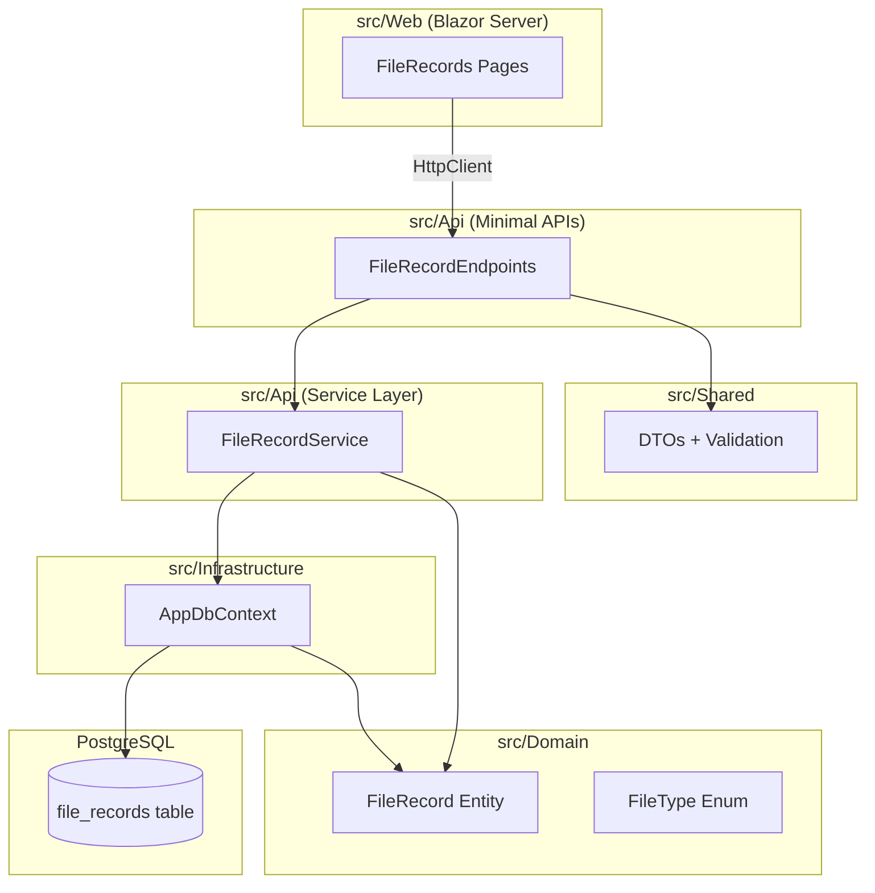

# Design Document: File Records CRUD

## Overview

This design covers the full-stack implementation of CRUD operations for File Records in SinterPrints. A File Record represents a registered art file with metadata (name, type, client, date, and optional floppy disk number). The implementation follows the existing mono-repo architecture: Domain entity and enum in `src/Domain`, EF Core mapping in `src/Infrastructure`, DTOs in `src/Shared`, Minimal API endpoints in `src/Api`, Blazor UI pages in `src/Web`, and xUnit tests in `tests/Api.Tests`.

The design prioritizes simplicity and consistency with existing patterns — Minimal APIs with a thin service layer, EF Core with snake_case naming convention, and Blazor components with code-behind for complex logic.

## Architecture



**Request flow:**
1. Blazor UI calls the API via `HttpClient` (existing `"Api"` named client)
2. Minimal API endpoint receives the request, validates the DTO
3. Endpoint delegates to `FileRecordService` for business logic
4. Service uses `AppDbContext` to persist/query `FileRecord` entities
5. Response DTOs are returned to the client

## Components and Interfaces

### Domain Layer (`src/Domain`)

**FileType Enum** — `src/Domain/Enums/FileType.cs`

```csharp
namespace Domain.Enums;

public enum FileType
{
    CorelDRAW = 0,
    Photoshop = 1,
    Illustrator = 2,
    Inkscape = 3,
    PDF = 4,
    Other = 5
}
```

**FileRecord Entity** — `src/Domain/Entities/FileRecord.cs`

```csharp
namespace Domain.Entities;

using Domain.Enums;

public class FileRecord
{
    public Guid Id { get; set; }
    public string Name { get; set; } = string.Empty;
    public FileType FileType { get; set; }
    public int? FlopDiskNumber { get; set; }
    public DateTime Date { get; set; }
    public string Client { get; set; } = string.Empty;
}
```

### Shared Layer (`src/Shared`)

**CreateFileRecordRequest** — `src/Shared/Dtos/CreateFileRecordRequest.cs`

```csharp
namespace Shared.Dtos;

using System.ComponentModel.DataAnnotations;
using Domain.Enums;

public record CreateFileRecordRequest(
    [Required(ErrorMessage = "O nome é obrigatório.")]
    [MinLength(1, ErrorMessage = "O nome não pode ser vazio.")]
    string Name,

    [Required(ErrorMessage = "O tipo de arquivo é obrigatório.")]
    [EnumDataType(typeof(FileType), ErrorMessage = "Tipo de arquivo inválido.")]
    FileType FileType,

    int? FlopDiskNumber,

    [Required(ErrorMessage = "A data é obrigatória.")]
    DateTime Date,

    [Required(ErrorMessage = "O cliente é obrigatório.")]
    [MinLength(1, ErrorMessage = "O cliente não pode ser vazio.")]
    string Client
);
```

**UpdateFileRecordRequest** — `src/Shared/Dtos/UpdateFileRecordRequest.cs`

Same shape as `CreateFileRecordRequest` (same validation rules apply on update).

```csharp
namespace Shared.Dtos;

using System.ComponentModel.DataAnnotations;
using Domain.Enums;

public record UpdateFileRecordRequest(
    [Required(ErrorMessage = "O nome é obrigatório.")]
    [MinLength(1, ErrorMessage = "O nome não pode ser vazio.")]
    string Name,

    [Required(ErrorMessage = "O tipo de arquivo é obrigatório.")]
    [EnumDataType(typeof(FileType), ErrorMessage = "Tipo de arquivo inválido.")]
    FileType FileType,

    int? FlopDiskNumber,

    [Required(ErrorMessage = "A data é obrigatória.")]
    DateTime Date,

    [Required(ErrorMessage = "O cliente é obrigatório.")]
    [MinLength(1, ErrorMessage = "O cliente não pode ser vazio.")]
    string Client
);
```

**FileRecordResponse** — `src/Shared/Dtos/FileRecordResponse.cs`

```csharp
namespace Shared.Dtos;

using Domain.Enums;

public record FileRecordResponse(
    Guid Id,
    string Name,
    FileType FileType,
    int? FlopDiskNumber,
    DateTime Date,
    string Client
);
```

### Infrastructure Layer (`src/Infrastructure`)

**AppDbContext update** — Add `DbSet<FileRecord>` and configure mapping:

```csharp
using Domain.Entities;
using Microsoft.EntityFrameworkCore;

namespace Infrastructure.Data;

public class AppDbContext : DbContext
{
    public AppDbContext(DbContextOptions<AppDbContext> options)
        : base(options) { }

    public DbSet<FileRecord> FileRecords => Set<FileRecord>();

    protected override void OnModelCreating(ModelBuilder modelBuilder)
    {
        base.OnModelCreating(modelBuilder);
        modelBuilder.HasDefaultSchema("public");

        modelBuilder.Entity<FileRecord>(entity =>
        {
            entity.ToTable("file_records");
            entity.HasKey(e => e.Id);
            entity.Property(e => e.Id).HasColumnType("uuid");
            entity.Property(e => e.Name).IsRequired();
            entity.Property(e => e.FileType).IsRequired();
            entity.Property(e => e.FlopDiskNumber);
            entity.Property(e => e.Date).HasColumnType("timestamptz");
            entity.Property(e => e.Client).IsRequired();
        });
    }
}
```

Note: The `EFCore.NamingConventions` package (already installed) handles snake_case column naming automatically via `UseSnakeCaseNamingConvention()`.

### Service Layer (`src/Api`)

**IFileRecordService** — `src/Api/Services/IFileRecordService.cs`

```csharp
namespace Api.Services;

using Shared.Dtos;

public interface IFileRecordService
{
    Task<List<FileRecordResponse>> GetAllAsync();
    Task<FileRecordResponse?> GetByIdAsync(Guid id);
    Task<FileRecordResponse> CreateAsync(CreateFileRecordRequest request);
    Task<FileRecordResponse?> UpdateAsync(Guid id, UpdateFileRecordRequest request);
    Task<bool> DeleteAsync(Guid id);
}
```

**FileRecordService** — `src/Api/Services/FileRecordService.cs`

```csharp
namespace Api.Services;

using Domain.Entities;
using Infrastructure.Data;
using Microsoft.EntityFrameworkCore;
using Shared.Dtos;

public class FileRecordService : IFileRecordService
{
    private readonly AppDbContext _dbContext;

    public FileRecordService(AppDbContext dbContext)
    {
        _dbContext = dbContext;
    }

    public async Task<List<FileRecordResponse>> GetAllAsync()
    {
        return await _dbContext.FileRecords
            .OrderByDescending(f => f.Date)
            .Select(f => ToResponse(f))
            .ToListAsync();
    }

    public async Task<FileRecordResponse?> GetByIdAsync(Guid id)
    {
        var entity = await _dbContext.FileRecords.FindAsync(id);
        return entity is null ? null : ToResponse(entity);
    }

    public async Task<FileRecordResponse> CreateAsync(CreateFileRecordRequest request)
    {
        var entity = new FileRecord
        {
            Id = Guid.NewGuid(),
            Name = request.Name.Trim(),
            FileType = request.FileType,
            FlopDiskNumber = request.FlopDiskNumber,
            Date = request.Date,
            Client = request.Client.Trim()
        };

        _dbContext.FileRecords.Add(entity);
        await _dbContext.SaveChangesAsync();

        return ToResponse(entity);
    }

    public async Task<FileRecordResponse?> UpdateAsync(Guid id, UpdateFileRecordRequest request)
    {
        var entity = await _dbContext.FileRecords.FindAsync(id);
        if (entity is null) return null;

        entity.Name = request.Name.Trim();
        entity.FileType = request.FileType;
        entity.FlopDiskNumber = request.FlopDiskNumber;
        entity.Date = request.Date;
        entity.Client = request.Client.Trim();

        await _dbContext.SaveChangesAsync();

        return ToResponse(entity);
    }

    public async Task<bool> DeleteAsync(Guid id)
    {
        var entity = await _dbContext.FileRecords.FindAsync(id);
        if (entity is null) return false;

        _dbContext.FileRecords.Remove(entity);
        await _dbContext.SaveChangesAsync();

        return true;
    }

    private static FileRecordResponse ToResponse(FileRecord entity) =>
        new(entity.Id, entity.Name, entity.FileType, entity.FlopDiskNumber, entity.Date, entity.Client);
}
```

### API Endpoints (`src/Api`)

**FileRecordEndpoints** — `src/Api/Endpoints/FileRecordEndpoints.cs`

Following the same pattern as `HealthEndpoints.cs`:

```csharp
namespace Api.Endpoints;

using Api.Services;
using Shared.Dtos;

public static class FileRecordEndpoints
{
    public static void MapFileRecordEndpoints(this WebApplication app)
    {
        var group = app.MapGroup("/api/file-records")
            .RequireAuthorization("Authenticated");

        group.MapGet("/", async (IFileRecordService service) =>
        {
            var records = await service.GetAllAsync();
            return Results.Ok(records);
        });

        group.MapGet("/{id:guid}", async (Guid id, IFileRecordService service) =>
        {
            var record = await service.GetByIdAsync(id);
            return record is null ? Results.NotFound() : Results.Ok(record);
        });

        group.MapPost("/", async (CreateFileRecordRequest request, IFileRecordService service) =>
        {
            var created = await service.CreateAsync(request);
            return Results.Created($"/api/file-records/{created.Id}", created);
        }).AddEndpointFilter<ValidationFilter<CreateFileRecordRequest>>();

        group.MapPut("/{id:guid}", async (Guid id, UpdateFileRecordRequest request, IFileRecordService service) =>
        {
            var updated = await service.UpdateAsync(id, request);
            return updated is null ? Results.NotFound() : Results.Ok(updated);
        }).AddEndpointFilter<ValidationFilter<UpdateFileRecordRequest>>();

        group.MapDelete("/{id:guid}", async (Guid id, IFileRecordService service) =>
        {
            var deleted = await service.DeleteAsync(id);
            return deleted ? Results.NoContent() : Results.NotFound();
        });
    }
}
```

**ValidationFilter** — `src/Api/Filters/ValidationFilter.cs`

A reusable endpoint filter for DataAnnotations validation:

```csharp
namespace Api.Endpoints;

using System.ComponentModel.DataAnnotations;

public class ValidationFilter<T> : IEndpointFilter where T : class
{
    public async ValueTask<object?> InvokeAsync(EndpointFilterInvocationContext context, EndpointFilterDelegate next)
    {
        var argument = context.Arguments.OfType<T>().FirstOrDefault();

        if (argument is null)
            return Results.BadRequest(new { errors = new[] { "Request body is required." } });

        var validationResults = new List<ValidationResult>();
        var validationContext = new ValidationContext(argument);

        if (!Validator.TryValidateObject(argument, validationContext, validationResults, validateAllProperties: true))
        {
            var errors = validationResults
                .Where(r => r.ErrorMessage is not null)
                .Select(r => r.ErrorMessage!)
                .ToArray();

            return Results.BadRequest(new { errors });
        }

        return await next(context);
    }
}
```

### Blazor UI (`src/Web`)

**File Records List Page** — `src/Web/Components/Pages/FileRecords.razor` + `.razor.cs`

The list page displays all records in a table with actions to create, edit, and delete.

**File Record Form Page** — `src/Web/Components/Pages/FileRecordForm.razor` + `.razor.cs`

A shared form component used for both create and edit operations. Uses `EditForm` with `DataAnnotationsValidator` following the Login page pattern.

**Key UI decisions:**
- Route: `/file-records` for list, `/file-records/new` for create, `/file-records/{id}/edit` for edit
- Uses the existing `HttpClient` named `"Api"` for API calls
- Code-behind pattern (`.razor.cs`) for all pages with logic
- `EditForm` + `DataAnnotationsValidator` for client-side validation
- FileType rendered as a `<select>` dropdown
- Date rendered as `<InputDate>`
- FlopDiskNumber rendered as optional `<InputNumber>`
- Delete uses a confirmation dialog before sending the request

## Data Models

### Database Schema

```sql
CREATE TABLE public.file_records (
    id              uuid            PRIMARY KEY DEFAULT gen_random_uuid(),
    name            text            NOT NULL,
    file_type       integer         NOT NULL,
    flop_disk_number integer        NULL,
    date            timestamptz     NOT NULL,
    client          text            NOT NULL
);
```

Column naming is handled automatically by `EFCore.NamingConventions` (`UseSnakeCaseNamingConvention()`).

### Entity-DTO Mapping

| FileRecord (Entity) | CreateFileRecordRequest | UpdateFileRecordRequest | FileRecordResponse |
|---------------------|------------------------|------------------------|-------------------|
| Id (Guid)           | —                      | —                      | Id (Guid)         |
| Name (string)       | Name (string)          | Name (string)          | Name (string)     |
| FileType (enum)     | FileType (FileType)    | FileType (FileType)    | FileType (FileType)|
| FlopDiskNumber (int?)| FlopDiskNumber (int?) | FlopDiskNumber (int?)  | FlopDiskNumber (int?)|
| Date (DateTime)     | Date (DateTime)        | Date (DateTime)        | Date (DateTime)   |
| Client (string)     | Client (string)        | Client (string)        | Client (string)   |

## Correctness Properties

*A property is a characteristic or behavior that should hold true across all valid executions of a system — essentially, a formal statement about what the system should do. Properties serve as the bridge between human-readable specifications and machine-verifiable correctness guarantees.*

### Property 1: Creation round-trip preserves data

*For any* valid file record input (with non-empty Name, valid FileType, non-empty Client, valid Date, and optional FlopDiskNumber), creating the record via POST and then retrieving it via GET by the returned Id SHALL produce a response with all fields matching the original input and a non-empty generated Id.

**Validates: Requirements 1.1, 1.6, 2.2**

### Property 2: Validation rejects invalid inputs

*For any* file record request where Name is empty/whitespace, OR FileType is outside the valid enum range, OR Client is empty/whitespace, the API SHALL return HTTP 400 and the record SHALL NOT be persisted.

**Validates: Requirements 1.2, 1.3, 1.5, 3.3**

### Property 3: List ordering by Date descending

*For any* set of file records with distinct dates, when all are created and then the list endpoint is called, the returned records SHALL be ordered such that each record's Date is greater than or equal to the next record's Date.

**Validates: Requirements 2.1**

### Property 4: Update preserves Id and persists changes

*For any* existing file record and any valid update payload, updating the record SHALL return the same Id as the original and all other fields SHALL match the update payload.

**Validates: Requirements 3.1, 3.4**

### Property 5: Delete removes record from persistence

*For any* existing file record, after a successful DELETE (204), a subsequent GET by the same Id SHALL return 404.

**Validates: Requirements 4.1**

## Error Handling

| Scenario | HTTP Status | Response Body |
|----------|-------------|---------------|
| Valid creation | 201 | `FileRecordResponse` with `Location` header |
| Valid read (list) | 200 | `FileRecordResponse[]` |
| Valid read (by id) | 200 | `FileRecordResponse` |
| Valid update | 200 | `FileRecordResponse` |
| Valid delete | 204 | Empty |
| Validation failure | 400 | `{ "errors": ["..."] }` |
| Record not found | 404 | Empty (default ProblemDetails) |
| Unauthenticated | 401 | `{ "error": "...", "message": "..." }` (existing JWT handler) |
| Unexpected server error | 500 | Generic error (middleware) |

**Validation approach:**
- Use `DataAnnotations` on request DTOs
- Custom `ValidationFilter<T>` endpoint filter validates before the handler executes
- Whitespace-only strings are caught by `[MinLength(1)]` after trimming in the service layer — however, to properly reject whitespace-only at the API boundary, a custom validation attribute or manual check in the filter can be added

**Design decision:** Validation happens at the API boundary (endpoint filter), not in the service layer. The service trusts that inputs are already validated. This keeps the service focused on persistence logic.

## Testing Strategy

### Test Structure

Tests live in `tests/Api.Tests/` using the existing `CustomWebApplicationFactory` with InMemory database.

**Test files:**
- `tests/Api.Tests/FileRecordEndpointTests.cs` — Example-based endpoint tests for all CRUD operations
- `tests/Api.Tests/FileRecordPropertyTests.cs` — Property-based tests using FsCheck (already in project dependencies)

### Property-Based Tests (FsCheck)

The project already uses FsCheck 3.3.3 with FsCheck.Xunit. Each correctness property maps to a single property-based test with minimum 100 iterations.

| Property | Test Method | Tag |
|----------|-------------|-----|
| Property 1 | `CreateThenGet_RoundTrip_PreservesAllFields` | Feature: file-records-crud, Property 1: Creation round-trip preserves data |
| Property 2 | `Create_InvalidInput_Returns400AndDoesNotPersist` | Feature: file-records-crud, Property 2: Validation rejects invalid inputs |
| Property 3 | `GetAll_MultipleRecords_ReturnedOrderedByDateDescending` | Feature: file-records-crud, Property 3: List ordering by Date descending |
| Property 4 | `Update_ValidPayload_PreservesIdAndUpdatesFields` | Feature: file-records-crud, Property 4: Update preserves Id and persists changes |
| Property 5 | `Delete_ExistingRecord_SubsequentGetReturns404` | Feature: file-records-crud, Property 5: Delete removes record from persistence |

### Example-Based Tests (xUnit)

Focused tests for specific scenarios and edge cases:

- `Create_MissingDate_Returns400`
- `Create_WithoutFlopDiskNumber_PersistsAsNull`
- `GetById_NonExistentId_Returns404`
- `Update_NonExistentId_Returns404`
- `Delete_NonExistentId_Returns404`

### Test Configuration

- All API tests use `CustomWebApplicationFactory` (InMemory database)
- Property tests configure FsCheck with `MaxTest = 100`
- Test naming follows: `MethodUnderTest_Scenario_ExpectedResult`
- Tests authenticate using a test JWT token (or bypass auth in the factory for simplicity)

### Authentication in Tests

The `CustomWebApplicationFactory` will need an additional configuration to either:
1. Add a test authentication handler that bypasses JWT validation, OR
2. Generate valid test tokens

Recommended approach: Add a `TestAuthHandler` that auto-authenticates all requests in the test environment, registered via `builder.ConfigureServices` in the factory.
