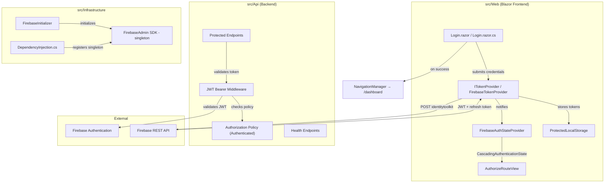
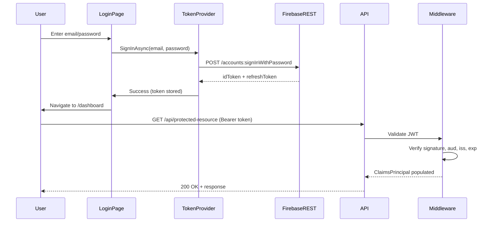

# Design Document: Firebase Authentication

## Overview

This design integrates Firebase Authentication into SinterPrints as the sole identity provider. The system validates Firebase JWT tokens on every protected API request to ensure only authenticated users access protected endpoints, connects the existing Blazor login page to Firebase for real authentication, and manages session lifecycle (login, token refresh, logout).

### Key Design Decisions

1. **Firebase Admin SDK in Infrastructure layer**: The FirebaseAdmin SDK is initialized at startup as a singleton in `src/Infrastructure/Auth/`, providing the foundation for future administrative operations. No admin endpoints are exposed in this version.
2. **ASP.NET Core JWT Bearer authentication**: Standard `AddAuthentication().AddJwtBearer()` pipeline validates Firebase tokens using Firebase's public keys — no custom token parsing.
3. **Single authorization policy ("Authenticated")**: Only one policy exists — `RequireAuthenticatedUser()`. No role-based policies in this version.
4. **Firebase REST API for client-side auth**: The Blazor frontend calls Firebase's `identitytoolkit` REST API via `HttpClient` to exchange email/password for tokens — no Firebase JS SDK dependency.
5. **ProtectedLocalStorage for token persistence**: Tokens are stored in browser local storage via Blazor's `ProtectedLocalStorage`, encrypted at rest.
6. **Custom AuthenticationStateProvider**: A `FirebaseAuthStateProvider` tracks auth state, handles token refresh, and integrates with Blazor's `CascadingAuthenticationState`.

## Architecture



### Request Flow



## Components and Interfaces

### Infrastructure Layer

#### FirebaseInitializer

Static helper called during `AddInfrastructure` that:
1. Reads `Firebase:ServiceAccountPath` from configuration
2. Validates file exists and contains valid JSON
3. Creates `FirebaseApp` singleton via `FirebaseApp.Create()`

```csharp
namespace Infrastructure.Auth;

internal static class FirebaseInitializer
{
    public static void Initialize(IConfiguration configuration)
    {
        var serviceAccountPath = configuration["Firebase:ServiceAccountPath"];

        if (string.IsNullOrWhiteSpace(serviceAccountPath))
            throw new InvalidOperationException(
                "Required configuration key 'Firebase:ServiceAccountPath' is missing or empty");

        if (!File.Exists(serviceAccountPath))
            throw new FileNotFoundException(
                $"Firebase service account file not found at path: {serviceAccountPath}",
                serviceAccountPath);

        try
        {
            var credential = GoogleCredential.FromFile(serviceAccountPath);
            FirebaseApp.Create(new AppOptions { Credential = credential });
        }
        catch (Exception ex) when (ex is not FileNotFoundException && ex is not InvalidOperationException)
        {
            throw new InvalidOperationException(
                $"Firebase service account file at '{serviceAccountPath}' contains invalid credentials", ex);
        }
    }
}
```

#### IAuthService (placeholder for future use)

```csharp
namespace Infrastructure.Auth;

public interface IAuthService
{
    // Reserved for future administrative operations (user management, claims, etc.)
}

internal class FirebaseAuthService : IAuthService
{
    // Empty implementation — placeholder for future admin features
}
```

#### DependencyInjection.cs additions

```csharp
// Inside AddInfrastructure extension method:
FirebaseInitializer.Initialize(configuration);
services.AddScoped<IAuthService, FirebaseAuthService>();
```

### API Layer

#### Authentication Setup (Program.cs additions)

```csharp
var projectId = builder.Configuration["Firebase:ProjectId"];

if (string.IsNullOrWhiteSpace(projectId))
    throw new InvalidOperationException(
        "Required configuration key 'Firebase:ProjectId' is missing or empty");

builder.Services
    .AddAuthentication(JwtBearerDefaults.AuthenticationScheme)
    .AddJwtBearer(options =>
    {
        options.Authority = $"https://securetoken.google.com/{projectId}";
        options.TokenValidationParameters = new TokenValidationParameters
        {
            ValidateIssuer = true,
            ValidIssuer = $"https://securetoken.google.com/{projectId}",
            ValidateAudience = true,
            ValidAudience = projectId,
            ValidateLifetime = true,
            ClockSkew = TimeSpan.FromMinutes(5)
        };
    });

builder.Services.AddAuthorizationBuilder()
    .AddPolicy("Authenticated", policy =>
        policy.RequireAuthenticatedUser());
```

#### Custom 401 Response Handling

A custom `JwtBearerEvents` handler to produce structured JSON error responses:

```csharp
options.Events = new JwtBearerEvents
{
    OnChallenge = context =>
    {
        context.HandleResponse();
        context.Response.StatusCode = 401;
        context.Response.ContentType = "application/json";

        var error = context.AuthenticateFailure switch
        {
            SecurityTokenExpiredException => ("token_expired", "The token has expired."),
            _ when context.Request.Headers.ContainsKey("Authorization")
                => ("invalid_token", "The token is invalid."),
            _ => ("missing_token", "No authentication token was provided.")
        };

        var json = JsonSerializer.Serialize(new { error = error.Item1, message = error.Item2 });
        return context.Response.WriteAsync(json);
    }
};
```

### Web Layer (Blazor Frontend)

#### ITokenProvider

```csharp
namespace Web.Services;

public interface ITokenProvider
{
    Task<AuthResult> SignInAsync(string email, string password);
    Task<string?> GetTokenAsync();
    Task SignOutAsync();
    Task<bool> RefreshTokenAsync();
}

public record AuthResult(bool Success, string? Token, string? ErrorMessage);
```

#### FirebaseTokenProvider

Implements `ITokenProvider`:
- Uses `HttpClient` to call Firebase REST API (`https://identitytoolkit.googleapis.com/v1/accounts:signInWithPassword?key={apiKey}`)
- Stores tokens in `ProtectedLocalStorage`
- Handles token refresh via `https://securetoken.googleapis.com/v1/token?key={apiKey}`
- 15-second timeout on HTTP calls
- Retry logic: up to 2 retries with 2-second delay for refresh

#### FirebaseAuthStateProvider

Extends `AuthenticationStateProvider`:
- Reads token from `ProtectedLocalStorage` on initialization
- Parses JWT claims to build `ClaimsPrincipal`
- Exposes `NotifyAuthenticationStateChanged` when tokens change
- Checks token expiration before API calls; triggers refresh if within 5 minutes
- On refresh failure, clears state and redirects to `/login`

#### Updated Login.razor.cs

```csharp
public partial class Login
{
    [Inject] private ITokenProvider TokenProvider { get; set; } = default!;
    [Inject] private NavigationManager Navigation { get; set; } = default!;

    private LoginModel Model { get; set; } = new();
    private bool IsSubmitting { get; set; }
    private string? ErrorMessage { get; set; }

    private async Task HandleValidSubmit()
    {
        IsSubmitting = true;
        ErrorMessage = null;
        StateHasChanged();

        using var cts = new CancellationTokenSource(TimeSpan.FromSeconds(30));
        try
        {
            var result = await TokenProvider.SignInAsync(Model.Email, Model.Password);
            if (result.Success)
            {
                Navigation.NavigateTo("/dashboard");
            }
            else
            {
                ErrorMessage = result.ErrorMessage;
            }
        }
        catch (OperationCanceledException)
        {
            ErrorMessage = "O serviço está demorando para responder. Tente novamente.";
        }
        catch
        {
            ErrorMessage = "Serviço indisponível. Tente novamente mais tarde.";
        }
        finally
        {
            IsSubmitting = false;
            StateHasChanged();
        }
    }

    private void OnFieldChanged()
    {
        if (ErrorMessage is not null)
        {
            ErrorMessage = null;
            StateHasChanged();
        }
    }

    public sealed class LoginModel
    {
        [Required(ErrorMessage = "O email é obrigatório.")]
        [EmailAddress(ErrorMessage = "Formato de email inválido.")]
        [StringLength(256)]
        public string Email { get; set; } = string.Empty;

        [Required(ErrorMessage = "A senha é obrigatória.")]
        [StringLength(128, MinimumLength = 6, ErrorMessage = "A senha deve ter no mínimo 6 caracteres.")]
        public string Password { get; set; } = string.Empty;
    }
}
```

## Data Models

### Configuration Model

#### FirebaseOptions (bound from `Firebase` section)

| Property | Type | Purpose |
|----------|------|---------|
| ProjectId | string | Firebase project ID (used for JWT validation) |
| ServiceAccountPath | string | Path to service account JSON file |
| ApiKey | string | Firebase Web API key (for REST API calls from frontend) |

### appsettings.json structure

```json
{
  "Firebase": {
    "ProjectId": "",
    "ServiceAccountPath": "",
    "ApiKey": ""
  }
}
```

### Firebase REST API Response Models (internal to FirebaseTokenProvider)

#### SignInResponse

| Property | Type | Purpose |
|----------|------|---------|
| IdToken | string | Firebase JWT token |
| RefreshToken | string | Token used to refresh the JWT |
| ExpiresIn | string | Token lifetime in seconds |
| LocalId | string | Firebase UID |
| Email | string | User's email |

#### RefreshResponse

| Property | Type | Purpose |
|----------|------|---------|
| Id_token | string | New JWT token |
| Refresh_token | string | New refresh token |
| Expires_in | string | Token lifetime in seconds |

#### FirebaseErrorResponse

| Property | Type | Purpose |
|----------|------|---------|
| Error.Code | int | HTTP status code |
| Error.Message | string | Firebase error code (e.g., "EMAIL_NOT_FOUND", "INVALID_PASSWORD") |

## Correctness Properties

*A property is a characteristic or behavior that should hold true across all valid executions of a system — essentially, a formal statement about what the system should do. Properties serve as the bridge between human-readable specifications and machine-verifiable correctness guarantees.*

### Property 1: Valid JWT claim extraction preserves token identity

*For any* valid Firebase JWT payload containing a UID and email, when the authentication middleware processes the token, the resulting `ClaimsPrincipal` SHALL contain a NameIdentifier claim equal to the UID and an Email claim equal to the email from the token.

**Validates: Requirements 1.2**

### Property 2: Malformed tokens are uniformly rejected

*For any* string that is not a valid JWT (random bytes, truncated tokens, tokens with invalid signatures), the authentication middleware SHALL return HTTP 401 with error field `"invalid_token"`.

**Validates: Requirements 1.4**

### Property 3: Token audience and issuer validation

*For any* JWT where the `aud` claim does not equal the configured `ProjectId` OR the `iss` claim does not equal `https://securetoken.google.com/{ProjectId}`, the authentication middleware SHALL reject the token as invalid regardless of all other claims being correct.

**Validates: Requirements 1.6**

### Property 4: Clock skew boundary enforcement

*For any* JWT token whose expiration time is between 0 and 5 minutes in the past, the middleware SHALL accept the token. For any token whose expiration time is more than 5 minutes in the past, the middleware SHALL reject it.

**Validates: Requirements 1.7**

### Property 5: Startup credential file validation

*For any* file path configured as `Firebase:ServiceAccountPath`, if the file does not exist OR contains content that is not valid service account JSON, the application SHALL throw an exception at startup whose message contains the file path.

**Validates: Requirements 2.3, 2.4, 6.5**

### Property 6: Firebase error codes map to user-friendly messages

*For any* Firebase Authentication error response (invalid credentials, user disabled, too many attempts, etc.), the `TokenProvider` SHALL map it to a localized user-facing message that does not contain the original Firebase error code, HTTP status code, or stack trace.

**Validates: Requirements 3.3**

### Property 7: Token refresh triggers within expiration window

*For any* stored JWT token whose expiration time is within 5 minutes of the current time, when `GetTokenAsync()` is called, the `TokenProvider` SHALL attempt a token refresh before returning the token.

**Validates: Requirements 3.6**

### Property 8: Authenticated policy accepts any authenticated user

*For any* `ClaimsPrincipal` that represents an authenticated identity (regardless of which claims it carries), the `Authenticated` authorization policy SHALL evaluate to success. For any unauthenticated principal, the policy SHALL evaluate to failure.

**Validates: Requirements 5.5**

### Property 9: Missing configuration key exception identifies the key

*For any* required Firebase configuration key (`ProjectId` or `ServiceAccountPath`) that is missing or empty at startup, the application SHALL throw an exception whose message contains both the key name and the configuration section path `Firebase:{KeyName}`.

**Validates: Requirements 6.4**

## Error Handling

### Backend (API)

| Scenario | HTTP Status | Response Body |
|----------|-------------|---------------|
| Valid request, success | 200 | Resource JSON |
| Missing token on protected endpoint | 401 | `{ "error": "missing_token", "message": "..." }` |
| Expired token | 401 | `{ "error": "token_expired", "message": "..." }` |
| Malformed/invalid token | 401 | `{ "error": "invalid_token", "message": "..." }` |
| Unexpected server error | 500 | `{ "error": "internal_error", "message": "..." }` |

### Frontend (Blazor)

| Scenario | User-Facing Behavior |
|----------|---------------------|
| Invalid credentials | "Email ou senha incorretos." displayed below form |
| Account disabled | "Sua conta está desativada. Contate o administrador." |
| Network error | "Serviço indisponível. Tente novamente mais tarde." |
| Timeout (30s) | "O serviço está demorando para responder. Tente novamente." |
| Token refresh failure | Silent redirect to `/login` |
| Field modification after error | Error message cleared immediately |

### Startup Failures

| Scenario | Behavior |
|----------|----------|
| Missing `Firebase:ProjectId` | Exception: `"Required configuration key 'Firebase:ProjectId' is missing or empty"` |
| Missing `Firebase:ServiceAccountPath` | Exception: `"Required configuration key 'Firebase:ServiceAccountPath' is missing or empty"` |
| Service account file not found | Exception: `"Firebase service account file not found at path: {path}"` |
| Invalid service account JSON | Exception: `"Firebase service account file at '{path}' contains invalid credentials"` |

## Testing Strategy

### Unit Tests (xUnit + NSubstitute)

**API Layer (`tests/Api.Tests/`):**
- JWT Bearer middleware error response formatting (401 scenarios with correct error codes)
- Authorization policy evaluation ("Authenticated" policy)
- Configuration validation at startup (missing keys)

**Infrastructure Layer (within `tests/Api.Tests/` or dedicated):**
- `FirebaseInitializer` with missing/invalid credential files
- Configuration validation logic

**Web Layer (`tests/Web.Tests/`):**
- `FirebaseTokenProvider` with mocked `HttpClient` (sign-in, refresh, timeout)
- `FirebaseAuthStateProvider` state transitions (authenticated → unauthenticated, refresh flow)
- Login page integration with `ITokenProvider` (bUnit)
- Error message display and clearing behavior
- Token refresh timing logic
- Logout flow (storage cleared, state transitioned)

### Property-Based Tests (FsCheck + xUnit)

- **Library**: FsCheck 2.x with `FsCheck.Xunit`
- **Minimum iterations**: 100 per property
- **Tag format**: `Feature: firebase-authentication, Property {number}: {property_text}`

Property tests target:

1. **Property 1** — Generate random (uid, email) pairs, create mock JWT payloads, verify `ClaimsPrincipal` contains matching NameIdentifier and Email claims.
2. **Property 2** — Generate random non-JWT strings (arbitrary bytes, partial JWTs, wrong signatures), verify all produce 401 with `"invalid_token"`.
3. **Property 3** — Generate random (projectId, tokenAud, tokenIss) tuples where aud ≠ projectId or iss ≠ expected pattern, verify rejection.
4. **Property 4** — Generate tokens with expiration times at various offsets around the 5-minute boundary, verify acceptance/rejection matches the boundary.
5. **Property 5** — Generate random file paths (non-existent) and random invalid file contents, verify exception message contains the path.
6. **Property 6** — Generate various Firebase error codes/messages, verify mapped output contains no internal error codes or stack traces.
7. **Property 7** — Generate tokens with random expiration times, verify refresh is triggered iff within 5 minutes of expiry.
8. **Property 8** — Generate random `ClaimsPrincipal` instances (authenticated with various claims, and unauthenticated), verify policy passes iff authenticated.
9. **Property 9** — Generate scenarios with each required key missing/empty, verify exception message contains key name and section path.

### Integration Tests (`tests/Integration/`)

- Full authentication flow with `WebApplicationFactory<Program>` and mocked Firebase token validation
- Token validation pipeline end-to-end (valid token → 200, invalid → 401)
- Configuration loading from environment variables
- Protected endpoint access control

### What Is NOT Tested

- Firebase Authentication service availability (external dependency)
- Firebase Console configuration (self-registration disabled)
- Browser storage encryption (framework responsibility)
- Visual styling preservation (manual review)
- Actual Firebase REST API responses (mocked in tests)
