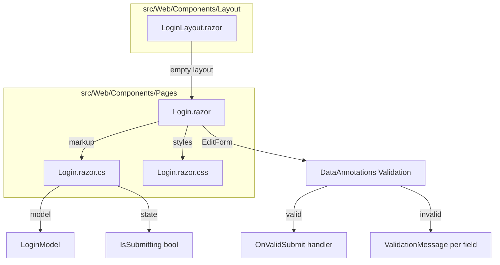

# Design Document: Login Page

## Overview

The login page is the first screen users encounter when accessing SinterPrints. It provides a branded, visually polished entry point with email/password fields and client-side validation. This implementation covers only the visual structure, layout, form validation behavior, and loading state — no backend authentication integration.

The page uses Blazor Interactive Server rendering with `EditForm` + `DataAnnotations` for validation, isolated CSS for scoped styling, and a code-behind file for logic separation.

### Key Design Decisions

1. **Custom layout via `@layout`**: The login page uses a minimal empty layout (no sidebar/nav) to render the full-viewport gradient without the MainLayout chrome.
2. **DataAnnotations on a nested model class**: The `LoginModel` is defined as a nested class inside the page's code-behind partial class, keeping it co-located and private.
3. **Isolated CSS only**: All visual styling lives in `Login.razor.css` — no global CSS modifications needed.
4. **No authentication wiring**: The `OnValidSubmit` handler simulates a delay (for loading state demonstration) but does not call any auth service.

## Architecture



### Component Hierarchy

1. **LoginLayout.razor** — A minimal layout with no sidebar/nav, just renders `@Body`. The login page opts into this layout via `@layout LoginLayout`.
2. **Login.razor** — The page component with Razor markup only (no `@code` block). Contains the gradient wrapper, card, logo, `EditForm`, inputs, button, and validation messages.
3. **Login.razor.cs** — Code-behind partial class with `LoginModel`, form state (`IsSubmitting`), and the `HandleValidSubmit` method.
4. **Login.razor.css** — Isolated CSS with all gradient, card, input, and button styles.

### Routing

The page declares two `@page` directives:
- `@page "/"`
- `@page "/login"`

This means the existing `Home.razor` page (which currently has `@page "/"`) will need its route changed or be removed, since the login page takes over as the default landing page.

## Components and Interfaces

### LoginLayout.razor

A bare-bones layout that renders only the body content, allowing the login page to control the entire viewport.

```razor
@inherits LayoutComponentBase

@Body
```

### Login.razor (Markup)

Structure:
```
div.login-page              ← full-viewport gradient background
  div.login-card            ← centered dark card
    img.login-logo          ← logo image
    EditForm                ← bound to LoginModel
      div.form-group        ← email field + validation
        label + InputText
        ValidationMessage
      div.form-group        ← password field + validation
        label + InputText (type=password)
        ValidationMessage
      button.btn-entrar     ← submit button with loading state
```

### Login.razor.cs (Code-Behind)

```csharp
namespace Web.Components.Pages;

public partial class Login
{
    private LoginModel Model { get; set; } = new();
    private bool IsSubmitting { get; set; }

    private async Task HandleValidSubmit()
    {
        IsSubmitting = true;
        StateHasChanged();

        // Simulate async operation (future auth call)
        await Task.Delay(1500);

        IsSubmitting = false;
        StateHasChanged();
    }

    public sealed class LoginModel
    {
        [Required(ErrorMessage = "O email é obrigatório.")]
        [EmailAddress(ErrorMessage = "Formato de email inválido.")]
        [StringLength(256)]
        public string Email { get; set; } = string.Empty;

        [Required(ErrorMessage = "A senha é obrigatória.")]
        [StringLength(128, MinimumLength = 6, ErrorMessage = "A senha deve ter no mínimo 6 caracteres.")]
        public string Password { get; set; } = string.Empty;
    }
}
```

### Login.razor.css (Isolated Styles)

Key style rules:
- `.login-page`: `min-height: 100vh; width: 100vw; background: linear-gradient(to bottom, #0099CC, #00BFFF); display: flex; align-items: center; justify-content: center;`
- `.login-card`: `background: #1A1A1A; border-radius: 12px; box-shadow: 0 4px 12px rgba(0,0,0,0.5); max-width: 440px; width: 100%; padding: 40px; color: #FFFFFF;`
- Input fields: `border: 1px solid #00BFFF; background: transparent; color: #FFFFFF;`
- `.btn-entrar`: `background: #FF0066; color: #FFFFFF; width: 100%; transition: background-color 300ms;` with hover state `background: #FFCC00; color: #FFFFFF;`
- Responsive: `@media (max-width: 576px) { .login-card { width: 92%; padding: 24px; } }`

## Data Models

### LoginModel

| Property | Type   | Annotations                                              | Purpose                    |
|----------|--------|----------------------------------------------------------|----------------------------|
| Email    | string | `[Required]`, `[EmailAddress]`, `[StringLength(256)]`    | User's email credential    |
| Password | string | `[Required]`, `[StringLength(128, MinimumLength = 6)]`   | User's password credential |

### Component State

| Field        | Type | Default | Purpose                                      |
|--------------|------|---------|----------------------------------------------|
| Model        | LoginModel | new() | Backing model for EditForm binding       |
| IsSubmitting | bool | false   | Controls button disabled/loading state       |


## Correctness Properties

*A property is a characteristic or behavior that should hold true across all valid executions of a system — essentially, a formal statement about what the system should do. Properties serve as the bridge between human-readable specifications and machine-verifiable correctness guarantees.*

### Property 1: LoginModel validation accepts only valid inputs

*For any* email string that matches a valid email format and has length ≤ 256, combined with *any* password string with length between 6 and 128 (inclusive), the LoginModel SHALL pass DataAnnotations validation with zero errors.

**Validates: Requirements 8.4, 8.5**

### Property 2: Invalid email format is rejected

*For any* string that does not conform to a valid email address format (e.g., missing "@", missing domain, invalid characters), the LoginModel SHALL fail validation with an email-format error message, regardless of the password value.

**Validates: Requirements 4.5, 8.4**

### Property 3: Short password is rejected

*For any* non-empty string with fewer than 6 characters as the password, the LoginModel SHALL fail validation with a minimum-length error message, regardless of the email value.

**Validates: Requirements 5.4, 8.4**

### Property 4: Loading state disables submission

*For any* component state where IsSubmitting is true, the Entrar button SHALL have the `disabled` attribute set, and invoking the submit handler SHALL not initiate a new submission (idempotence: submitting while already submitting has no additional effect).

**Validates: Requirements 7.1, 7.4**

### Property 5: Submit round-trip restores initial state

*For any* valid LoginModel that triggers a submission, after the async operation completes, the component SHALL return to IsSubmitting = false with the button enabled and displaying "Entrar" text.

**Validates: Requirements 7.3**

## Error Handling

### Validation Errors

- **Empty email**: Displays "O email é obrigatório." adjacent to the email field.
- **Invalid email format**: Displays "Formato de email inválido." adjacent to the email field.
- **Empty password**: Displays "A senha é obrigatória." adjacent to the password field.
- **Password too short**: Displays "A senha deve ter no mínimo 6 caracteres." adjacent to the password field.
- Validation messages appear only after form submission attempt (not on blur), following Blazor's default `EditForm` behavior.

### Logo Load Failure

- The `` element includes `alt="SinterPrints"` so the browser displays fallback text if the image fails to load. No additional error handling is needed at the component level.

### Future Authentication Errors

- The `HandleValidSubmit` method currently simulates a delay. When Firebase integration is added, errors (network failure, invalid credentials) will be caught and displayed as a general error message above or below the form. The design accommodates this by keeping the handler async and the loading state pattern already in place.

## Testing Strategy

### Unit Tests (xUnit + bUnit)

Use **bUnit** for Blazor component testing:

1. **Render structure**: Verify the login page renders with expected elements (logo, email input, password input, button).
2. **Route directives**: Verify `@page "/"` and `@page "/login"` are declared.
3. **Validation messages**: Submit with empty fields → verify error messages appear.
4. **Valid submission**: Fill valid data, submit → verify `OnValidSubmit` is invoked and no validation messages shown.
5. **Loading state rendering**: Set `IsSubmitting = true` → verify button shows "Entrando...", is disabled, and has spinner.
6. **Button text**: Verify default button text is "Entrar".
7. **Accessibility**: Verify email input has associated label and correct type attribute.

### Property-Based Tests (FsCheck + xUnit)

Use **FsCheck** (via `FsCheck.Xunit`) for property-based testing of the LoginModel validation:

- **Library**: FsCheck 2.x with FsCheck.Xunit integration
- **Minimum iterations**: 100 per property
- **Tag format**: `Feature: login-page, Property {number}: {property_text}`

Property tests target the `LoginModel` class directly using `System.ComponentModel.DataAnnotations.Validator`:

1. **Property 1** — Generate random valid email/password pairs → assert zero validation errors.
2. **Property 2** — Generate random non-email strings → assert validation fails with email error.
3. **Property 3** — Generate random strings of length 1–5 → assert validation fails with length error.
4. **Property 4** — Verify that when `IsSubmitting` is true, calling the handler does not change state (idempotence).
5. **Property 5** — Trigger valid submit, await completion → assert `IsSubmitting` returns to false.

### What Is NOT Tested

- Visual appearance (gradient colors, border radius, box shadow) — verified by manual review and CSS inspection.
- CSS isolation behavior — guaranteed by the Blazor framework.
- Responsive breakpoints — verified manually or via browser dev tools.
- Logo image rendering — browser behavior, verified by alt attribute presence.
