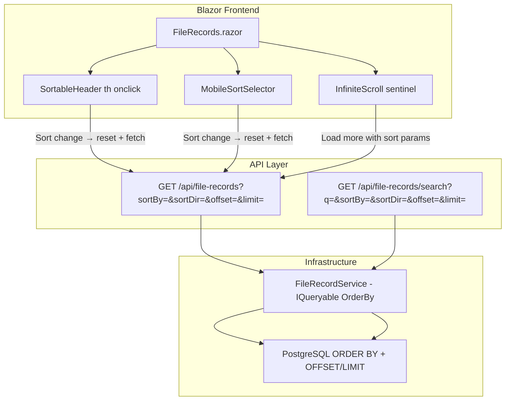

# Design Document: Server-Side Column Sorting

## Overview

This feature adds server-side column sorting to the `/file-records` page. Since the table uses infinite scroll (lazy loading with paginated API calls), sorting must be performed in the database query to guarantee correct ordering across all loaded pages. Users click column headers (desktop) or use a sort selector (mobile) to change the active sort.

### Key Design Decisions

1. **Server-side sorting via query parameters** — Sort parameters (`sortBy`, `sortDir`) are passed as query strings to the existing paginated endpoints. The database applies `ORDER BY` before `OFFSET`/`LIMIT`, ensuring consistent results across pages.
2. **Toggle behavior on header click** — Clicking a new column sorts ASC; clicking the same column toggles ASC ↔ DESC. Simple and predictable.
3. **Null handling** — `NULLS LAST` for ascending, `NULLS FIRST` for descending. This keeps null-valued records at the end regardless of direction.
4. **Reset on sort change** — Changing sort resets the records list and fetches from offset 0, same as initial load. The infinite scroll continues with the new sort parameters.
5. **Mobile sort selector** — A dropdown above the card list replaces the non-clickable column headers on small screens.

## Architecture



### Request Flow

1. User clicks a column header (or selects from mobile dropdown)
2. Blazor updates `CurrentSortField` and `CurrentSortDirection` state
3. Records list is cleared, `IsLoading` is set, fetch starts from offset 0
4. API receives `?sortBy=name&sortDir=asc&offset=0&limit=50`
5. `FileRecordService` applies `ORDER BY` to the EF Core query dynamically
6. Results returned; infinite scroll continues appending with the same sort parameters

## Components and Interfaces

### API Layer

#### Modified Endpoints

Both existing paginated endpoints gain two optional query parameters:

```
GET /api/file-records?offset=0&limit=50&sortBy=name&sortDir=asc
GET /api/file-records/search?q=term&offset=0&limit=50&sortBy=date&sortDir=desc
```

| Parameter | Type   | Default | Valid Values |
|-----------|--------|---------|--------------|
| `sortBy`  | string | `date`  | `name`, `file_type`, `file_number`, `client`, `date`, `flop_disk_number` |
| `sortDir` | string | `desc`  | `asc`, `desc` |

Invalid `sortBy` values fall back to `date`. Invalid `sortDir` values fall back to `asc`.

#### IFileRecordService Changes

```csharp
public interface IFileRecordService
{
    Task<PaginatedResponse<FileRecordResponse>> GetPagedAsync(int offset, int limit, string? sortBy = null, string? sortDir = null);
    Task<PaginatedResponse<FileRecordResponse>> SearchPagedAsync(string searchTerm, int offset, int limit, string? sortBy = null, string? sortDir = null);
    // ... existing methods unchanged
}
```

#### FileRecordService — Dynamic Ordering

```csharp
private static readonly HashSet<string> ValidSortFields = new(StringComparer.OrdinalIgnoreCase)
{
    "name", "file_type", "file_number", "client", "date", "flop_disk_number"
};

private static IQueryable<FileRecord> ApplySort(IQueryable<FileRecord> query, string? sortBy, string? sortDir)
{
    var field = ValidSortFields.Contains(sortBy ?? "") ? sortBy! : "date";
    var descending = string.Equals(sortDir, "desc", StringComparison.OrdinalIgnoreCase);

    // Default direction for "date" when no explicit sortDir is provided
    if (field == "date" && sortDir is null)
        descending = true;

    return (field, descending) switch
    {
        ("name", false) => query.OrderBy(f => f.Name),
        ("name", true) => query.OrderByDescending(f => f.Name),
        ("file_type", false) => query.OrderBy(f => f.FileType),
        ("file_type", true) => query.OrderByDescending(f => f.FileType),
        ("file_number", false) => query.OrderBy(f => f.FileNumber == null).ThenBy(f => f.FileNumber),
        ("file_number", true) => query.OrderByDescending(f => f.FileNumber != null).ThenByDescending(f => f.FileNumber),
        ("client", false) => query.OrderBy(f => f.Client),
        ("client", true) => query.OrderByDescending(f => f.Client),
        ("date", false) => query.OrderBy(f => f.Date == null).ThenBy(f => f.Date),
        ("date", true) => query.OrderByDescending(f => f.Date != null).ThenByDescending(f => f.Date),
        ("flop_disk_number", false) => query.OrderBy(f => f.FlopDiskNumber == null).ThenBy(f => f.FlopDiskNumber),
        ("flop_disk_number", true) => query.OrderByDescending(f => f.FlopDiskNumber != null).ThenByDescending(f => f.FlopDiskNumber),
        _ => query.OrderByDescending(f => f.Date != null).ThenByDescending(f => f.Date)
    };
}
```

For the search endpoint with raw SQL, the `ORDER BY` clause is built dynamically:

```csharp
private static string BuildOrderByClause(string? sortBy, string? sortDir)
{
    var field = ValidSortFields.Contains(sortBy ?? "") ? sortBy! : "date";
    var descending = string.Equals(sortDir, "desc", StringComparison.OrdinalIgnoreCase);

    if (field == "date" && sortDir is null)
        descending = true;

    var direction = descending ? "DESC" : "ASC";
    var nulls = descending ? "NULLS FIRST" : "NULLS LAST";

    return $"{field} {direction} {nulls}, id";
}
```

### Frontend Layer

#### New State (FileRecords.razor.cs)

```csharp
// Sort state
private string CurrentSortField { get; set; } = "date";
private string CurrentSortDirection { get; set; } = "desc";
```

#### SortBy Method

```csharp
private async Task SortBy(string field)
{
    if (field == CurrentSortField)
    {
        // Toggle direction
        CurrentSortDirection = CurrentSortDirection == "asc" ? "desc" : "asc";
    }
    else
    {
        CurrentSortField = field;
        CurrentSortDirection = "asc";
    }

    // Reset and reload
    _observerInitialized = false;
    if (IsSearchActive)
    {
        await ExecuteSearch();
    }
    else
    {
        await LoadRecords();
    }
}
```

#### Modified LoadRecords / LoadMoreItems / ExecuteSearch

All fetch calls append `&sortBy={CurrentSortField}&sortDir={CurrentSortDirection}` to the URL.

#### Table Header Rendering

```razor
@if (IsColumnVisible("name"))
{
    <th scope="col"
        class="sortable @(CurrentSortField == "name" ? "sorted" : "")"
        aria-sort="@GetAriaSortValue("name")"
        @onclick="() => SortBy("name")">
        Nome
        <span class="sort-indicator">@GetSortIcon("name")</span>
    </th>
}
```

#### Mobile Sort Selector

```razor
<div class="mobile-sort-control">
    <label for="mobile-sort-field">Ordenar por:</label>
    <select id="mobile-sort-field" @onchange="HandleMobileSortFieldChange">
        <option value="name">Nome</option>
        <option value="file_type">Tipo</option>
        <option value="file_number">Nº Arquivo</option>
        <option value="client">Cliente</option>
        <option value="date" selected="@(CurrentSortField == "date")">Data</option>
        <option value="flop_disk_number">Nº Disquete</option>
    </select>
    <button class="btn-sort-dir" @onclick="ToggleSortDirection" aria-label="Inverter ordem">
        @(CurrentSortDirection == "asc" ? "↑" : "↓")
    </button>
</div>
```

This mobile control is shown only inside `.cards-container` (hidden on desktop via CSS media queries).

## Data Models

### Query Parameters (extended)

| Parameter | Type   | Default | Description |
|-----------|--------|---------|-------------|
| `offset`  | int    | 0       | Pagination offset |
| `limit`   | int    | 50      | Page size (1-100) |
| `sortBy`  | string | `date`  | Column to sort by |
| `sortDir` | string | varies* | Sort direction |

*`sortDir` defaults to `desc` when `sortBy=date`, `asc` for all other fields.

### Column-to-Field Mapping

| Column Header | Sort Field | DB Column | Notes |
|---------------|-----------|-----------|-------|
| Nome | `name` | `name` | Text, case-sensitive in DB |
| Tipo | `file_type` | `file_type` | Integer enum |
| Nº Arquivo | `file_number` | `file_number` | Nullable text |
| Cliente | `client` | `client` | Text |
| Data | `date` | `date` | Nullable timestamptz |
| Nº Disquete | `flop_disk_number` | `flop_disk_number` | Nullable integer |

## Error Handling

| Scenario | Layer | Behavior |
|----------|-------|----------|
| Invalid `sortBy` value | API | Silently fallback to `date` |
| Invalid `sortDir` value | API | Silently fallback to `asc` |
| Sort change during loading | Blazor | Cancel/ignore in-flight request, use latest sort params |
| Network error on sort change | Blazor | Show existing error state, preserve previous records |

## Testing Strategy

### Unit Tests (xUnit)

- `ApplySort_ValidField_AppliesCorrectOrdering` (one per field, both directions)
- `ApplySort_InvalidField_FallsBackToDateDesc`
- `ApplySort_NullSortDir_DefaultsToAsc` (except date which defaults to desc)
- `GetPagedAsync_WithSortParams_ReturnsCorrectlyOrderedResults`
- `SearchPagedAsync_WithSortParams_ReturnsCorrectlyOrderedResults`
- `BuildOrderByClause_AllValidFields_ProducesValidSql`

### Property-Based Tests (FsCheck + xUnit)

| Property | What it validates |
|----------|-------------------|
| For any valid sortBy field and direction, consecutive pages never have overlapping items | Pagination + sort consistency |
| For any invalid sortBy string, the result matches date DESC ordering | Fallback behavior |
| For any sort direction, null values appear last (ASC) or first (DESC) | Null placement |

### Integration Tests (Testcontainers PostgreSQL)

- Sort by each field ASC and DESC with seeded data, verify order
- Pagination with sort params returns non-overlapping, correctly ordered pages
- Sort params work correctly with search endpoint

### Component Tests (bUnit)

- Column headers render as clickable with sort indicators
- Clicking a new column triggers sort with ASC direction
- Clicking same column toggles direction
- `aria-sort` attributes set correctly
- Mobile sort selector changes field and direction
- Sort change resets records and shows loading state
- Infinite scroll requests include sort parameters

