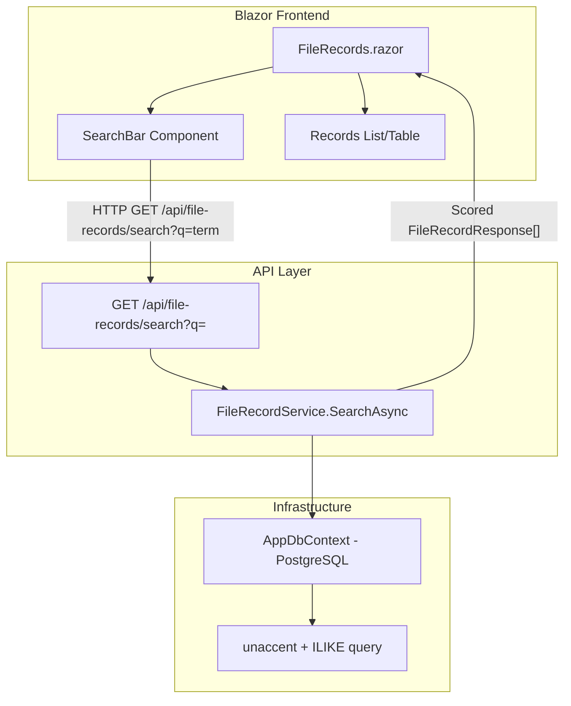

# Design Document: Smart Search File Records

## Overview

This feature adds a smart search capability to the `/file-records` Blazor page, allowing users to locate file records by typing fragments of file names or client names. The system performs fuzzy/partial matching server-side using PostgreSQL's built-in text functions, returns scored results prioritizing file name matches over client name matches, and redesigns the page layout to integrate the search bar alongside existing controls.

### Key Design Decisions

1. **Server-side search via dedicated API endpoint** — Search logic executes in PostgreSQL using `ILIKE` and the `unaccent` extension for accent-insensitive matching. This avoids loading all records into memory and leverages database indexing.
2. **Scoring algorithm in C#** — Match scores are computed in the application layer after the database returns candidate matches, keeping scoring logic testable and independent of SQL complexity.
3. **Single search endpoint** — A new `GET /api/file-records/search?q=term` endpoint keeps the existing CRUD endpoints unchanged while adding search as an orthogonal concern.
4. **Progressive enhancement of existing page** — The `FileRecords.razor` page gains a search row without breaking existing functionality; clearing the search restores the default view.

## Architecture



### Request Flow

1. User types a search term and clicks Search (or presses Enter)
2. Blazor component calls `GET /api/file-records/search?q={term}` via `AuthenticatedHttpClient`
3. API validates the `q` parameter (non-empty, max 200 chars)
4. `FileRecordService.SearchAsync` queries PostgreSQL using `unaccent(lower(...))` + `ILIKE` on `name` and `client` columns
5. Results are scored in C# (Name match = higher score, Client-only match = lower)
6. API returns top 100 results ordered by score descending
7. Blazor updates the records list with search results

## Components and Interfaces

### API Layer

#### New Endpoint: Search File Records

```
GET /api/file-records/search?q={searchTerm}
Authorization: Bearer {token}
```

Added to the existing `FileRecordEndpoints` group. Shares the same `RequireAuthorization("Authenticated")` policy.

#### IFileRecordService Extension

```csharp
public interface IFileRecordService
{
    // Existing methods...
    Task<List<FileRecordResponse>> SearchAsync(string searchTerm);
}
```

#### SearchAsync Implementation (FileRecordService)

```csharp
public async Task<List<FileRecordResponse>> SearchAsync(string searchTerm)
{
    var terms = searchTerm.Trim().Split(' ', StringSplitOptions.RemoveEmptyEntries);

    // Query: records where Name or Client contains ALL terms (accent/case insensitive)
    var query = _dbContext.FileRecords.AsQueryable();

    foreach (var term in terms)
    {
        var pattern = $"%{term}%";
        query = query.Where(f =>
            EF.Functions.ILike(EF.Functions.Collate(f.Name, "unaccent"), pattern) ||
            EF.Functions.ILike(EF.Functions.Collate(f.Client, "unaccent"), pattern));
    }

    var candidates = await query.ToListAsync();

    // Score in memory
    var scored = candidates
        .Select(f => new { Record = f, Score = ComputeScore(f, terms) })
        .Where(x => x.Score > 0)
        .OrderByDescending(x => x.Score)
        .Take(100)
        .Select(x => ToResponse(x.Record))
        .ToList();

    return scored;
}
```

#### Scoring Algorithm

```csharp
private static int ComputeScore(FileRecord record, string[] terms)
{
    var normalizedName = RemoveDiacritics(record.Name).ToLowerInvariant();
    var normalizedClient = RemoveDiacritics(record.Client).ToLowerInvariant();

    int score = 0;
    bool allTermsMatchName = true;
    bool allTermsMatchClient = true;

    foreach (var rawTerm in terms)
    {
        var term = RemoveDiacritics(rawTerm).ToLowerInvariant();
        bool nameMatch = normalizedName.Contains(term);
        bool clientMatch = normalizedClient.Contains(term);

        if (!nameMatch && !clientMatch) return 0; // Term not found anywhere

        if (nameMatch) score += 10;  // Name match weight
        if (clientMatch) score += 5; // Client match weight

        if (!nameMatch) allTermsMatchName = false;
        if (!clientMatch) allTermsMatchClient = false;
    }

    // Bonus for full name match
    if (allTermsMatchName) score += 5;

    return score;
}
```

Score priorities:
- Name-only match per term: 10 points
- Client-only match per term: 5 points
- Both match per term: 15 points (10 + 5)
- Bonus if all terms match Name: +5

This guarantees: Name match > Client-only match, and both-match >= Name-only match.

### Frontend Layer

#### FileRecords.razor — Layout Changes

The page header is restructured into:
1. Title row (h1 + subtitle)
2. Search row (Search_Bar + Search_Button + "Nova Ficha" button)
3. Results area (summary + table/cards)

#### New State Properties (FileRecords.razor.cs)

```csharp
private string SearchTerm { get; set; } = string.Empty;
private bool IsSearching { get; set; }
private bool HasSearchError { get; set; }
private bool IsSearchActive { get; set; }  // true when showing filtered results
private int? SearchResultCount { get; set; }
private string? SearchedTerm { get; set; }
```

#### Search Execution Flow

```csharp
private async Task ExecuteSearch()
{
    if (string.IsNullOrWhiteSpace(SearchTerm))
    {
        await ClearSearch();
        return;
    }

    IsSearching = true;
    HasSearchError = false;

    try
    {
        var client = await ApiClient.CreateClientAsync();
        var encoded = Uri.EscapeDataString(SearchTerm.Trim());
        Records = await client.GetFromJsonAsync<List<FileRecordResponse>>(
            $"/api/file-records/search?q={encoded}");
        SearchedTerm = SearchTerm.Trim();
        SearchResultCount = Records?.Count ?? 0;
        IsSearchActive = true;
    }
    catch
    {
        HasSearchError = true;
    }
    finally
    {
        IsSearching = false;
    }
}

private async Task ClearSearch()
{
    SearchTerm = string.Empty;
    IsSearchActive = false;
    SearchedTerm = null;
    SearchResultCount = null;
    await LoadRecords();
}
```

### Infrastructure Layer

#### PostgreSQL `unaccent` Extension

A new EF Core migration enables the `unaccent` extension:

```sql
CREATE EXTENSION IF NOT EXISTS unaccent;
```

This is required for accent-insensitive matching via `unaccent()` in SQL queries.

#### Query Strategy

The EF Core query uses PostgreSQL's `unaccent` function combined with `ILIKE` for pattern matching:

```sql
SELECT * FROM file_records
WHERE unaccent(lower(name)) ILIKE unaccent(lower('%term%'))
   OR unaccent(lower(client)) ILIKE unaccent(lower('%term%'));
```

For multi-word queries, each word becomes an additional `WHERE` condition (all must match in at least one field).

## Data Models

### Existing Domain Entity (unchanged)

```csharp
public class FileRecord
{
    public Guid Id { get; set; }
    public string Name { get; set; }
    public FileType FileType { get; set; }
    public int? FlopDiskNumber { get; set; }
    public DateTime? Date { get; set; }
    public string Client { get; set; }
    public string? FileNumber { get; set; }
}
```

### Search Request (query parameter)

| Parameter | Type   | Constraints         | Description      |
|-----------|--------|---------------------|------------------|
| `q`       | string | 1-200 chars, required for search | Search term |

### Search Response

Same `FileRecordResponse` DTO as existing endpoints. Results are ordered by relevance score (descending).

### Scoring Model (internal, not exposed)

| Field Match | Points per Term | Notes |
|-------------|----------------|-------|
| Name match  | 10             | Higher priority |
| Client match| 5              | Lower priority |
| Both match  | 15             | Cumulative |
| All terms in Name bonus | +5 | Rewards full name coverage |

## Correctness Properties

*A property is a characteristic or behavior that should hold true across all valid executions of a system — essentially, a formal statement about what the system should do. Properties serve as the bridge between human-readable specifications and machine-verifiable correctness guarantees.*

### Property 1: Substring matching inclusivity

*For any* file record and *for any* search term that is a contiguous substring of the record's Name or Client field (after case-insensitive and accent-insensitive normalization), the search engine SHALL include that record in the results.

**Validates: Requirements 3.1, 3.2, 3.4, 4.1**

### Property 2: Multi-word independent matching

*For any* multi-word search term (whitespace-separated) and *for any* file record whose Name contains each individual word as a case-insensitive, accent-insensitive contiguous substring (regardless of word order), the search engine SHALL include that record in the results.

**Validates: Requirements 3.3**

### Property 3: Whitespace input returns empty results

*For any* string composed entirely of whitespace characters (including the empty string), the search engine SHALL return an empty result set without performing matching.

**Validates: Requirements 3.5, 7.2**

### Property 4: Scoring invariants

*For any* search term and *for any* two file records where one matches on the Name field and the other matches only on the Client field, the Name-matching record SHALL have a strictly higher score. Additionally, *for any* record matching on both Name and Client fields, its score SHALL be greater than or equal to a record matching only on the Name field.

**Validates: Requirements 4.2, 4.3**

### Property 5: Results are ordered by score descending with maximum 100 results

*For any* valid search term, the returned result list SHALL be sorted by match score in non-increasing order, and the list length SHALL not exceed 100 records.

**Validates: Requirements 4.4, 7.4**

### Property 6: Excessive input length is rejected

*For any* string with length greater than 200 characters, the search API SHALL return a 400 Bad Request response.

**Validates: Requirements 7.3**

## Error Handling

| Scenario | Layer | Behavior |
|----------|-------|----------|
| Empty/whitespace search term | API | Return HTTP 200 with `[]` |
| Search term > 200 chars | API | Return HTTP 400 with error message |
| Database unreachable | API | Return HTTP 500, log error, no internal details exposed |
| Network error during search | Blazor | Show error message, preserve previous list, re-enable button |
| Search timeout (>30s) | Blazor | Re-enable button, show error message |
| `unaccent` extension missing | API startup | Migration ensures extension exists; if removed, queries degrade to accent-sensitive matching |

### Error Message Patterns

- Client-side error: "Não foi possível completar a busca. Tente novamente."
- No results: "Nenhum resultado encontrado para '{term}'"
- Server 500: Logged via `ILogger<FileRecordService>`, generic message returned to client

## Testing Strategy

### Property-Based Tests (FsCheck + xUnit)

The scoring and matching logic is pure and deterministic — ideal for property-based testing. Each property test will run a minimum of **100 iterations** using FsCheck.

**Library**: FsCheck.Xunit (already referenced in the test projects per AGENTS.md)

**Target**: `FileRecordService` scoring/matching methods (extracted as static pure functions for testability).

| Property | Test Tag | What it validates |
|----------|----------|-------------------|
| 1 | `Feature: smart-search-file-records, Property 1: Substring matching inclusivity` | Any normalized substring match on Name/Client returns the record |
| 2 | `Feature: smart-search-file-records, Property 2: Multi-word independent matching` | Multi-word queries match regardless of word order in Name |
| 3 | `Feature: smart-search-file-records, Property 3: Whitespace input returns empty results` | Whitespace-only inputs produce empty results |
| 4 | `Feature: smart-search-file-records, Property 4: Scoring invariants` | Name score > Client-only score; both >= Name-only |
| 5 | `Feature: smart-search-file-records, Property 5: Results ordered and capped` | Output sorted descending, max 100 items |
| 6 | `Feature: smart-search-file-records, Property 6: Excessive input rejected` | Strings > 200 chars return 400 |

### Unit Tests (xUnit)

- `SearchAsync_WithSingleTerm_ReturnsMatchingRecords`
- `SearchAsync_WithMultipleWords_ReturnsRecordsMatchingAllWords`
- `SearchAsync_CaseInsensitive_MatchesRegardlessOfCase`
- `SearchAsync_AccentInsensitive_MatchesWithoutAccents`
- `SearchAsync_EmptyTerm_ReturnsEmptyList`
- `SearchAsync_NameMatchScoredHigherThanClientOnlyMatch`
- `ComputeScore_BothFieldsMatch_ScoreGreaterOrEqualToNameOnly`
- `SearchEndpoint_MissingQ_Returns200EmptyArray`
- `SearchEndpoint_QLengthExceeds200_Returns400`
- `SearchEndpoint_Unauthenticated_Returns401`

### Integration Tests (WebApplicationFactory + Testcontainers PostgreSQL)

- Verify `unaccent` extension works correctly in real PostgreSQL
- Verify end-to-end search with seeded data
- Verify 500 response when database is unavailable
- Verify authentication is required on search endpoint

### Component Tests (bUnit)

- Search bar renders with correct placeholder and maxlength
- Search button triggers API call with non-empty input
- Enter key triggers search
- Loading state shown during search
- Error message displayed on failure
- "Nenhum resultado encontrado" shown for zero results
- Results summary shows count and searched term
- Clearing search restores full list
- ARIA labels present on search elements
- Tab order is correct (Search_Bar → Search_Button → Nova Ficha)
- Responsive layout stacks vertically at ≤768px
