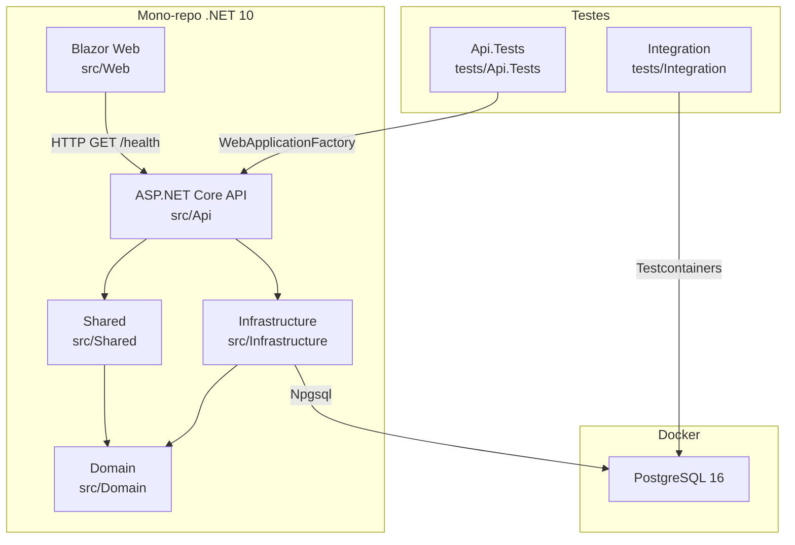

# Documento de Design: Walking Skeleton

## Visão Geral

O Walking Skeleton é a estrutura mínima funcional do projeto SinterPrints. Ele estabelece a fundação técnica do mono-repo .NET 10, provando que todas as camadas (API, frontend Blazor, banco de dados PostgreSQL, testes) se comunicam corretamente de ponta a ponta.

O objetivo não é implementar funcionalidades de negócio, mas sim garantir que a infraestrutura do projeto está operacional: o solution file organiza os projetos, a API responde a requisições, o EF Core conecta ao PostgreSQL, o Blazor consome a API, e os testes automatizados validam o comportamento.

Este skeleton serve como base confiável sobre a qual todas as features futuras serão construídas.

## Arquitetura



## Componentes e Interfaces

### Componente 1: API (src/Api)

**Propósito**: Expor endpoints HTTP. No walking skeleton, apenas o health-check.

**Interface**:
```csharp
// GET /health → 200 OK
// Endpoint mínimo que valida que a API está rodando
// e opcionalmente verifica a conexão com o banco

public static class HealthEndpoints
{
    public static void MapHealthEndpoints(this WebApplication app);
}
```

**Responsabilidades**:
- Configurar o pipeline ASP.NET Core (DI, middleware, endpoints)
- Registrar o endpoint de health-check
- Configurar conexão com o DbContext via DI

### Componente 2: Infrastructure (src/Infrastructure)

**Propósito**: Acesso a dados via EF Core. No skeleton, apenas o DbContext vazio configurado.

**Interface**:
```csharp
public class AppDbContext : DbContext
{
    public AppDbContext(DbContextOptions<AppDbContext> options) 
        : base(options) { }

    protected override void OnModelCreating(ModelBuilder modelBuilder)
    {
        // Configuração de snake_case via Npgsql
    }
}

public static class InfrastructureServiceExtensions
{
    public static IServiceCollection AddInfrastructure(
        this IServiceCollection services, 
        IConfiguration configuration);
}
```

**Responsabilidades**:
- Definir o DbContext com configuração de snake_case
- Registrar serviços de infraestrutura no DI container
- Gerenciar a connection string via configuração

### Componente 3: Web (src/Web)

**Propósito**: Frontend Blazor mínimo que consome a API.

**Interface**:
```csharp
// Página que faz GET /health na API e exibe o resultado
@page "/health"
public partial class HealthPage : ComponentBase
{
    // Injeta HttpClient configurado para a API
    // Exibe status da API (OK ou erro)
}
```

**Responsabilidades**:
- Configurar HttpClient para comunicação com a API
- Exibir uma página mínima com o status do health-check

### Componente 4: Domain (src/Domain)

**Propósito**: Camada de domínio. No skeleton, apenas o projeto vazio com estrutura base.

**Responsabilidades**:
- Existir como projeto referenciável
- Nenhuma entidade neste momento

### Componente 5: Shared (src/Shared)

**Propósito**: DTOs e contratos compartilhados entre projetos.

**Interface**:
```csharp
public record HealthCheckResponse(string Status, DateTime Timestamp);
```

**Responsabilidades**:
- Definir contratos compartilhados entre API e Web
- Manter DTOs de resposta

### Componente 6: Docker Compose

**Propósito**: Prover o PostgreSQL para desenvolvimento local.

**Interface**:
```yaml
services:
  postgres:
    image: postgres:16
    ports:
      - "5432:5432"
    environment:
      POSTGRES_DB: sinterprints
      POSTGRES_USER: sinterprints
      POSTGRES_PASSWORD: sinterprints_dev
    volumes:
      - pgdata:/var/lib/postgresql/data
```

**Responsabilidades**:
- Subir PostgreSQL 16 com credenciais de desenvolvimento
- Persistir dados via volume nomeado

## Modelos de Dados

### HealthCheckResponse

```csharp
public record HealthCheckResponse(
    string Status,      // "Healthy" ou "Unhealthy"
    DateTime Timestamp  // UTC timestamp da verificação
);
```

**Regras de Validação**:
- `Status` deve ser "Healthy" ou "Unhealthy"
- `Timestamp` deve ser em UTC

### AppDbContext (sem entidades)

```csharp
// Nenhum DbSet neste momento
// Apenas prova que a conexão com PostgreSQL funciona
// Configuração de snake_case aplicada globalmente
```

## Tratamento de Erros

### Cenário 1: Banco de dados indisponível

**Condição**: PostgreSQL não está acessível quando o health-check é chamado
**Resposta**: O endpoint retorna 200 com status "Unhealthy" e informação sobre a falha de conexão
**Recuperação**: O sistema continua operando; próximas chamadas tentam reconectar automaticamente (connection pooling do Npgsql)

### Cenário 2: API indisponível (perspectiva do Blazor)

**Condição**: O frontend Blazor não consegue alcançar a API
**Resposta**: A página exibe mensagem de erro amigável ao usuário
**Recuperação**: O usuário pode tentar novamente; o HttpClient usa políticas de retry se configurado

## Estratégia de Testes

### Testes Unitários (Api.Tests)

- Usar `WebApplicationFactory<Program>` para testar o endpoint de health-check
- Verificar que GET /health retorna 200 OK
- Verificar que o corpo da resposta contém o formato esperado

### Testes de Integração (Integration)

- Usar Testcontainers para subir PostgreSQL real
- Verificar que o DbContext consegue conectar e executar operações básicas
- Verificar que o health-check reporta corretamente o status do banco

### Biblioteca de Property-Based Testing

- Não aplicável neste skeleton (sem lógica de negócio para testar com PBT)

## Considerações de Performance

- O health-check deve responder em menos de 100ms em condições normais
- A verificação de banco no health-check usa timeout curto (5s) para não bloquear
- Connection pooling do Npgsql gerencia conexões eficientemente

## Considerações de Segurança

- Credenciais do PostgreSQL em `appsettings.Development.json` (apenas dev)
- Em produção, usar variáveis de ambiente para connection strings
- O health-check não expõe informações sensíveis (versão do banco, connection string, etc.)
- Docker Compose é apenas para desenvolvimento local

## Dependências

| Pacote | Projeto | Propósito |
|--------|---------|-----------|
| Npgsql.EntityFrameworkCore.PostgreSQL | Infrastructure | Provider EF Core para PostgreSQL |
| Microsoft.EntityFrameworkCore.Design | Infrastructure | Tooling para migrations |
| Microsoft.AspNetCore.OpenApi | Api | Documentação de endpoints |
| xunit | Tests | Framework de testes |
| Microsoft.AspNetCore.Mvc.Testing | Api.Tests | WebApplicationFactory |
| Testcontainers.PostgreSql | Integration | Container PostgreSQL para testes |
| Microsoft.EntityFrameworkCore.InMemory | Api.Tests | Provider in-memory para testes unitários |

## Correctness Properties

*Uma propriedade é uma característica ou comportamento que deve ser verdadeiro em todas as execuções válidas do sistema — essencialmente, uma declaração formal sobre o que o sistema deve fazer.*

### Property 1: Health-check sempre retorna resposta válida

*Para qualquer* estado do sistema (banco disponível ou não), o endpoint GET /health deve retornar HTTP 200 com um corpo JSON contendo os campos `status` (string não-vazia) e `timestamp` (data válida em UTC).

**Validates: Requirements 2.1, 2.2**

### Property 2: Resposta do health-check reflete estado real do banco

*Para qualquer* chamada ao health-check, se o banco de dados está acessível, o campo `status` deve ser "Healthy"; se o banco está inacessível, o campo `status` deve ser "Unhealthy".

**Validates: Requirements 2.3, 2.4**

### Property 3: DbContext conecta com configuração válida

*Para qualquer* connection string válida apontando para um PostgreSQL acessível, o AppDbContext deve conseguir abrir uma conexão e executar uma query básica sem exceções.

**Validates: Requirements 3.1, 3.3**
